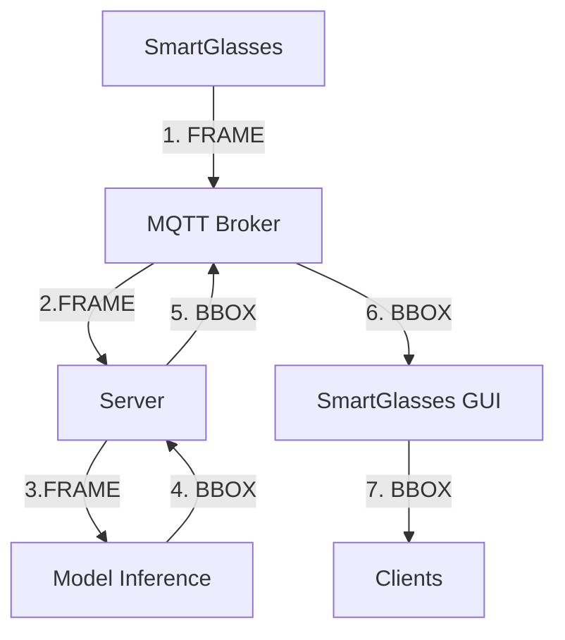
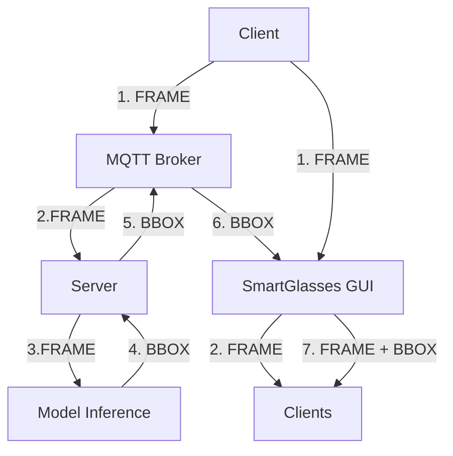
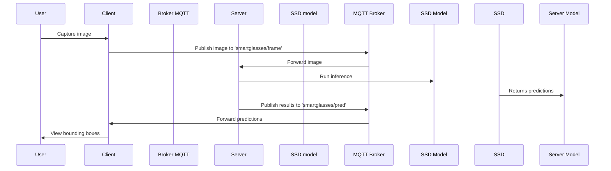
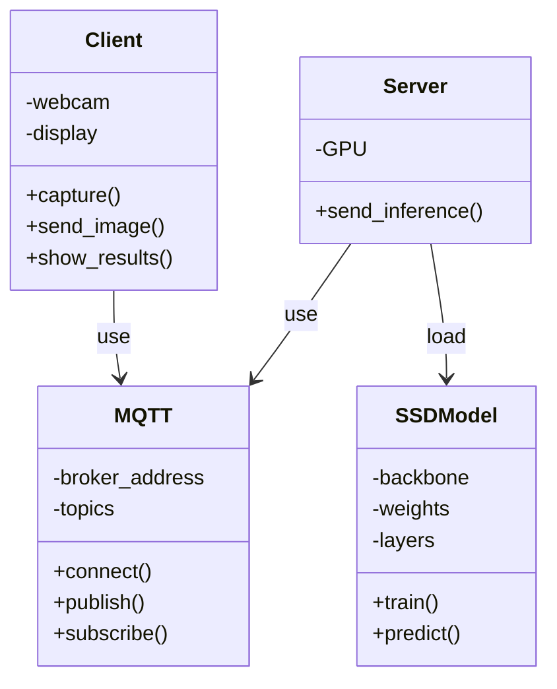
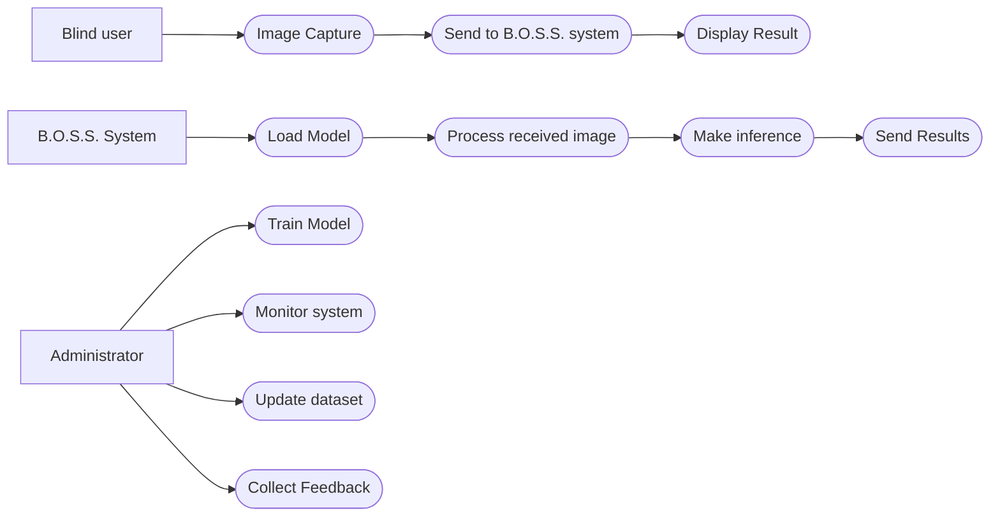

# 🚀 B.O.S.S. (Blind Oriented Suggested System) - SSD300 VGG16 Branch

  

[](https://www.python.org/)
[](https://pytorch.org/) 
[](https://opencv.org/)

[](https://www.docker.com/) 
[](https://mosquitto.org/)
[](https://universe.roboflow.com/objectdetection-uzld5/coco-home-objects)


This project implements a **SSD300** neural network based on **VGG16** for object detection, integrated into a distributed publisher-subscriber architecture with MQTT communication, supported by a minimal GUI on emulated SmartGlasses. The ultimate objective is to assist users with visual limitations in navigating.
  

---

  

## 📋 Table of Contents

- [🎯 Goal](#-goal)

- [🛠️ Technologies Used](#-technologies-used)

- [🏗️ Architecture of the Ideal System](#-architecture-of-the-ideal-system)

- [🏗️ System Architecture Emulating SmartGlasses](#-architecture-of-the-system-emulating-smartglasses)

- [⚡ Quickstart](#-quickstart)

- [🧠 Model Training](#-model-training)

- [📡 MQTT API](#-api-mqtt)

- [🐳 Docker Deployment](#-docker-deployment)

- [📋 FURPS+](#-furps)

- [📐 UML Diagrams](#-uml-diagrams)

- [✅ Involved Technologies CheckList](#-involved-technologies-checklist)

- [⏱️ Gantt Chart](#-gantt-chart)
  

---

  

## 🎯 Objective

  

The **B.O.S.S.** project aims to develop an artificial intelligence-based visual assistance system to support people with visual impairments using smart eyeglasses. Using advanced Computer Vision techniques, the system detects and classifies household objects in real time, providing video feedback for safe navigation.

  

**Key Features:**

- 🎥 Real-time object detection

- 📱 Minimal UI for wearable devices (AKA Smart Glasses)

- 🔄 Asynchronous communication via MQTT

- 🐳 Complete containerization with Docker

- ⚡ Optimized inference on GPU and CPU


---
  

## 🛠️ Technologies Used

### Artificial Intelligence and Learning Core

- 🧠 **PyTorch**: Deep learning framework, used for implementing and training the SSD300 model

- 👁 **TorchVision**: Computer vision library, provides SSD300 model with pre-trained VGG16 backbone

- 📸 **OpenCV**: For image and video processing, webcam capture and preprocessing

  

### Distributed Architecture

- 📡 **MQTT (Mosquitto)**: Lightweight messaging protocol for communication based on the publisher/subscriber model

- 🐳 **Docker & Docker Compose**: Containerization for scalable and portable deployment

  

### Development and Deployment

- 🐍 **Python 3.13**: Main language for all components

- 🔢 **NumPy & Pillow**: Array and image manipulation

- 📨 **Paho-MQTT**: Python library for MQTT

  

### Datasets

- 🏠 **COCO-Home-Objects**: Expanded COCO-based dataset for common household objects

---


## 🏗️ Architecture of the Ideal System




---


## 🏗️ System Architecture Emulating SmartGlasses




---

### Detailed Components


#### 1. 🧠 **Model SSD300-VGG16** 

- **Single Shot MultiBox Detector (SSD)**: One-stage architecture for object detection, provides both the spatial coordinates and the classification of recognized objects in a single neural network pass

- **VGG16 Backbone**: Pre-trained convolutional network

- **300x300 Input**: Optimal resolution for balanced speed/inference

- **Output**: Bounding boxes, classes and confidence scores for each detection

  

#### 2. 🔍 **Inference Service** 

- Receives images converted into bytes via **MQTT**

- **Preprocessing**: resize to 300x300, normalization

- **Inference**: Passing through the SSD model

- **Post-processing**: thresholding of predictions

- **Output**: JSON with detections (bbox, class, confidence)

  

#### 3. 👓 **Client Wearable**

- Simulation of **smart glasses**

- Capture **frames** from video

- Send to server via **MQTT**

- **Result display**: bounding boxes overlay


#### 4. 📡 **MQTT Broker** 

- **Mosquitto**: Lightweight and high-performance broker

- **Topics**: 
  - `smartglasses/frame` allows sending the frame, converted into bytes, to the inference server
  - `smartglasses/pred` allows sending predictions, formulated in a JSON structure, to the wearable client

- **QoS = 1**: Guarantees delivery at least once in the communication

  
---

  

## ⚡ Quickstart


Do you want to try B.O.S.S. in 5 minutes? 🚀


```bash
# N.B. To run on MacOS, requires XQuartz, after installation
# To enable Client Connections Open XQuartz -> Settings -> Security -> Allow Connections from Client Network
xhost +localhost

#1. Clone the repository

git clone https://github.com/riccardosemeraro/B.O.S.S.-SSD300-VGG16.git

cd B.O.S.S.-SSD300-VGG16

#2. Build and Launch everything with Docker
docker-compose up --build
```

The system will be active using 3 containers (`server`, `client`, `mqtt_broker`).

---
  

## 📦 Local Installation
  

### Prerequisites

- Python 3.13

- Docker & Docker Compose

- NVIDIA GPU (optional)

- CONDA


```bash

# Create virtual environment
conda create -p ./.venv python=3.13 pip

# Enable virtual environment
conda activate ./.venv

# Install dependencies
pip install -r inference/requirements_inference.txt

# Starting mqtt container
# in this case change BROKER_CONTAINER="localhost" instead of "mqtt_broker" in broker/configuration.py
docker run -d --name mosquitto -p 1883:1883 eclipse-mosquitto

# Starting server
python3 server/server.py

# Client startup
python3 client/client.py
```

  

### Dataset configuration

```bash

# Download the COCO-Home-Objects dataset at the link 
# https://universe.roboflow.com/objectdetection-uzld5/coco-home-objects
# instructions in training/README_dataset.txt

```

---
  

## 🧠 Model Training
The model was trained using the
Jupyter Notebook in training/jupyter Google Colab

---

## 📡 MQTT API

  

### Topics

  
| Topics | Management | Payloads | Description |
|------------------------| --------------- | -------------------- | ---------------------- |
| smartglasses/frame | Client → Server | Base64 encoded image | Image to analyze |
| smartglasses/pred | Server → Client | JSON detections | Detection Results |


---
  

## 🐳 Docker Deployment

  

### Container Structure

- **server**: Inference service

- **client**: GUI client with Tkinter

- **mqtt_broker**: Mosquitto MQTT broker
  

### Build and Run

```bash

# Build and Start docker-compose

docker-compose up -d --build

```

  

### GPU configuration

To train the model, GOOGLE COLAB was used, which provides the NVIDIA T4 GPU for a period of approximately 2/3 hours per day. Through checkpoint-based training, 100 epochs were performed, of which 20 on the "head" and 80 on the "body".

For inferences performed by the server, however, we use the APPLE SILICON M\* CPU, optimized for single-threaded (non-parallel) inferences. 

---

## 📋 FURPS+

  

### Functional

- **Object Detection**: The system must identify household objects with >50% accuracy

- **Classification**: Assign correct classes to detected objects

- **Bounding Boxes**: Provide precise coordinates of the bounding boxes

- **Real-time Processing**: Process images

  

### Usability

- **Simple Interface**: Minimal GUI accessible for users with visual impairments

- **Visual Feedback**: Overlay of clear and legible bounding boxes

  

### Reliability

- **Availability**: Guarantee the availability of the service

- **Robustness**: Handling network errors and MQTT connection loss

- **Accuracy**: Maintenance of performance on varied datasets

  

### Performance

- **Inference speed**: <300ms for 300x300 image

- **Throughput**: Very high

- **Scalability**: Possibility of horizontal scaling with multiple servers

  

### Supportability

- **Maintainability**: Modular and well-documented code

- **Testability**: Complete test suite for all components

- **Configurability**: Parameters adjustable via configuration file

- **Monitoring**: Detailed logging for debugging

- **Portability**: Supported by different devices thanks to containers

  

### + (Security, Privacy, etc.)

- **Security**: Optional MQTT authentication

- **Privacy**: No permanent storage of user images

- **Compliance**: Adherence to GDPR for personal data


---

## 📐 UML diagrams


### Sequence Diagram



  

### Class Diagram



  

### Use Case Diagram




---

  

## ✅ CheckList Technologies Involved

  

- [x] **Python 3.13**: Main language

- [x] **PyTorch 2.8**: Deep learning framework

- [x] **TorchVision**: SSD300 model with VGG16 Backbone and utilities

- [x] **OpenCV**: Image/video processing, minimal GUI

- [x] **MQTT (Mosquitto)**: Distributed communication, broker

- [x] **Paho-MQTT**: Python MQTT library for Clients and Servers

- [x] **Docker & Docker Compose**: Containerization

- [x] **COCO Dataset**: Training dataset

- [x] **NVIDIA GPU**: CUDA acceleration (used on Google Colab)

---

## ⏱️ Gantt chart

```mermaid
gantt
    title Gantt
    dateFormat YYYY-MM-DD
    axisFormat %d/%m/%y
    todayMarker off
    
    section Introduction
        Research : a1, 2025-10-10, 15d
        AI training: a2, after a1, 30d
    
    sectionTesting
        Object Detection: p4, after a2, 10d
        Sort: p5, after p4, 5d
        Tkinter GUI : p2, after p5, 7d
        OpenCV GUI : p3, after p2, 7d
        MQTT : p1, after p3, 5d
    
    section Beta Release
        Unify System : b1, after p1, 15d
        Documentation: after b1, 12d
    
```

---

---

  

*Created with ❤️ to make the world more accessible.*