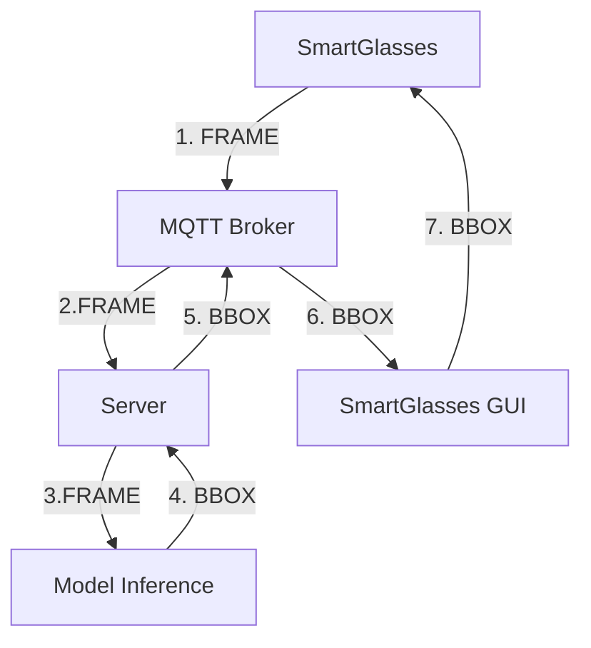
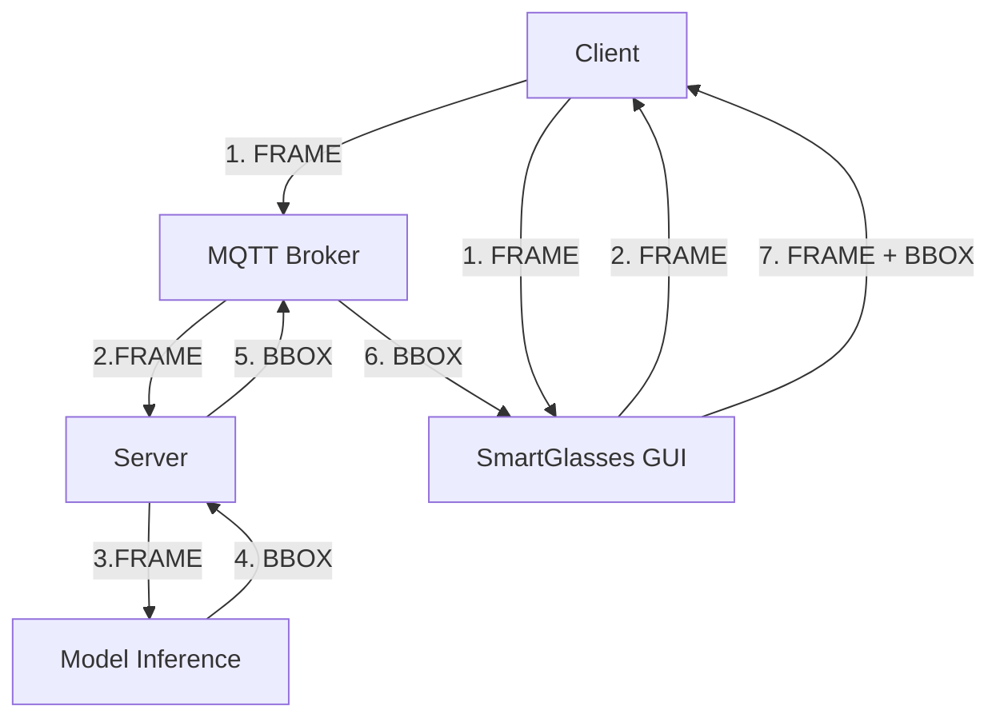
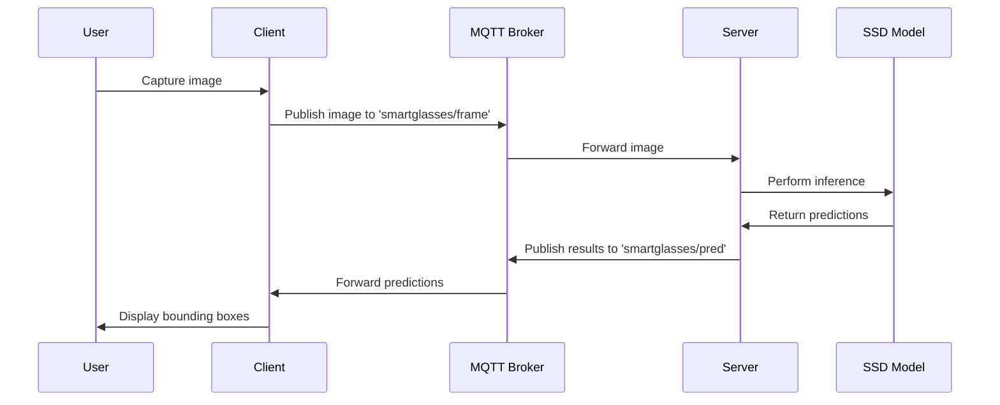
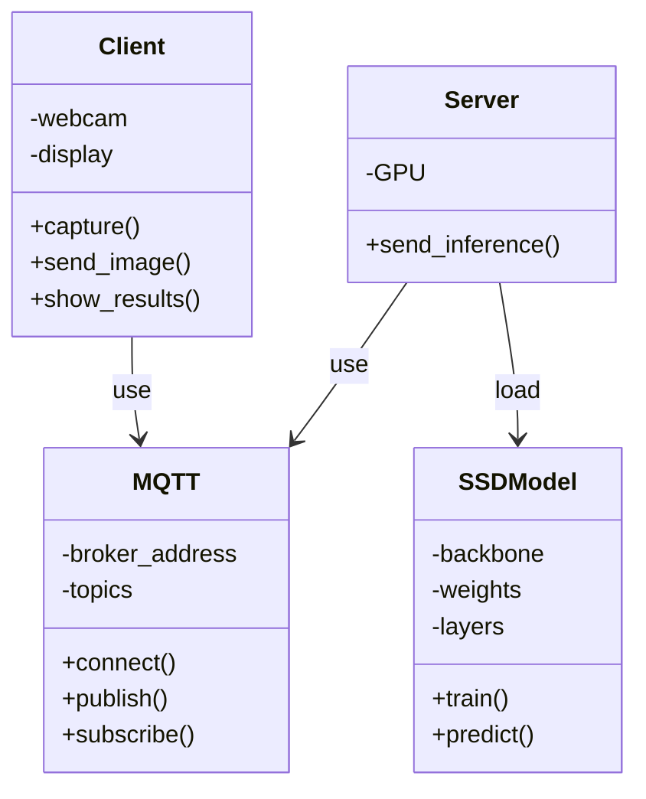
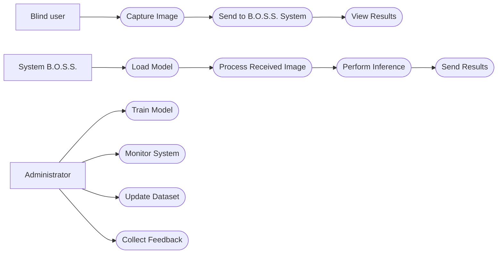

# 🚀 B.O.S.S. (Blind Oriented Suggested System) - SSD300 VGG16 Branch

  

[](https://www.python.org/)
[](https://pytorch.org/) 
[](https://opencv.org/)

[](https://www.docker.com/) 
[](https://mosquitto.org/)
[](https://universe.roboflow.com/objectdetection-uzld5/coco-home-objects)


This project implements a **SSD300** neural network based on **VGG16** for object detection, integrated into a distributed publisher-subscriber architecture with MQTT communication, supported by a minimal GUI on Emulated SmartGlasses. The ultimate goal is to assist users with visual impairments in navigation.
  

---

  

## 📋 Table of Contents

- [🎯 Goal](#-goal)

- [🛠️ Technologies Used](#-technologies-used)

- [🏗️ Ideal System Architecture](#-ideal-system-architecture)

- [🏗️ System Architecture Emulating SmartGlasses](#-system-architecture-emulating-smartglasses)

- [⚡ Quickstart](#-quickstart)

- [📦 Local Installation](#-local-installation)

- [🧠 Model Training](#-model-training)

- [📡 MQTT API](#-mqtt-api)

- [🐳 Docker Deployment](#-docker-deployment)

- [📋 FURPS+](#-furps)

- [📐 UML Diagrams](#-uml-diagrams)

- [✅ Involved Technologies Checklist](#-involved-technologies-checklist)

- [⏱️ Gantt Chart](#-gantt-chart)
  

---

  

## 🎯 Goal

  

The **B.O.S.S.** project aims to develop an AI-based visual assistance system to support people with visual impairments using smart glasses. Using advanced computer vision techniques, the system detects and classifies household objects in real time, providing video feedback for safe navigation.

  

**Key Features:**

- 🎥 Real-time object detection

- 📱 Minimal user interface for wearable devices (AKA smart glasses)

- 🔄 Asynchronous communication via MQTT

- 🐳 Full containerization with Docker

- ⚡ Optimized inference on GPUs and CPUs


---
  

## 🛠️ Technologies Used

### Artificial Intelligence and Learning Core

- 🧠 **PyTorch**: Deep learning framework, used for implementing and training the SSD300 model

- 👁 **TorchVision**: Computer vision library, provides the SSD300 model with a pre-trained VGG16 backbone

- 📸 **OpenCV**: For image and video processing, webcam capture, and preprocessing

### Distributed Architecture

- 📡 **MQTT (Mosquitto)**: Lightweight messaging protocol for publisher/subscriber communication

- 🐳 **Docker & Docker Compose**: Containerization for scalable and portable deployment

### Development and Deployment

- 🐍 **Python 3.13**: Core language for all components

- 🔢 **NumPy & Pillow**: Array and Image Manipulation

- 📨 **Paho-MQTT**: Python Library for MQTT

### Dataset

- 🏠 **COCO-Home-Objects**: Expanded COCO-based dataset for common household objects

---


## 🏗️ Ideal System Architecture




---


## 🏗️ System Architecture Emulating SmartGlasses




---

### Detailed Components

#### 1. 🧠 **SSD300-VGG16 Model**

- **Single Shot MultiBox Detector (SSD)**: One-stage architecture for object detection, provides both spatial coordinates and classification of recognized objects in a single neural network pass.

- **VGG16 Backbone**: Pre-trained convolutional network

- **300x300 Input**: Optimal resolution for balanced speed/inference

- **Output**: Bounding boxes, classes, and confidence scores for each detection.

#### 2. 🔍 **Inference Service**

- Receives images converted to bytes via **MQTT**

- **Preprocessing**: Resize to 300x300, normalization

- **Inference**: Pass through the SSD model

- **Post-processing**: Threshold predictions

- **Output**: JSON with detections (bbox, class, confidence)

#### 3. 👓 **Wearable Client**

- Simulation of **smart glasses**

- Capture **frames** from video

- Send to server via **MQTT**

- **Results display**: Bounding box overlay

#### 4. 📡 **MQTT Broker**

- **Mosquitto**: Lightweight and high-performance broker

- **Topics**:
- `smartglasses/frame` allows sending the frame, converted into bytes, to the inference server
- `smartglasses/pred` allows sending predictions, formulated in a JSON structure, to the wearable client

- **QoS = 1**: Guarantees delivery at least once in the communication

---

## ⚡ Quickstart

Want to try B.O.S.S. in 5 minutes? 🚀


```bash
# N.B. To run on MacOS, it requires XQuartz after installation.
# To enable Client Connections, open XQuartz -> Settings -> Security -> Allow Connections from Client Networks.
xhost +localhost

# 1. Clone the repository

git  clone  https://github.com/riccardosemeraro/B.O.S.S.-SSD300-VGG16.git

cd  B.O.S.S.-SSD300-VGG16

#2. Build and Run Everything with Docker
docker-compose up --build
```

The system will be active using 3 containers (`server`, `client`, `mqtt_broker`).

---
  

## 📦 Local Installation

### Prerequisites

- Python 3.13

- Docker & Docker Compose

- NVIDIA GPU (optional)

- CONDA

```bash

# Create virtual environment
conda create -p ./.venv python=3.13 pip

# Activate virtual environment
conda activate ./.venv

# Install dependencies
pip install -r inference/requirements_inference.txt

# Start mqtt container
# In this case, change BROKER_CONTAINER="localhost" instead of "mqtt_broker" in broker/configuration.py
docker run -d --name mosquitto -p 1883:1883 eclipse-mosquitto

# Start server
python3 server/server.py

# Start client
python3 client/client.py
```

### Dataset Configuration

```bash

# Download the COCO-Home-Objects dataset at
# https://universe.roboflow.com/objectdetection-uzld5/coco-home-objects
# instructions in training/README_dataset.txt

```

---
  

## 🧠 Model Training
The model was trained using the
Jupyter Notebook in training/jupyter Google Colab

---

## 📡 MQTT API

### Topics

| Topic | Direction | Payload | Description |
|-------------------| -------------- | -------------------- | ---------------------- |
| smartglasses/frame | Client → Server | Base64 encoded image | Image to analyze |
| smartglasses/pred | Server → Client | JSON detections | Detection results |

---

## 🐳 Docker Deployment

### Container Structure

- **server**: Inference service

- **client**: GUI client with Tkinter

- **mqtt_broker**: Mosquitto MQTT broker

### Build and Run

```bash

# Build and Run docker-compose

docker-compose up -d --build

```

  

### GPU Configuration

For model training, we used GOOGLE COLAB, which provides the NVIDIA T4 GPU for approximately 2-3 hours per day. Checkpoint-based training was used to run 100 epochs, 20 on the "head" and 80 on the "body."

For server-side inference, we used the APPLE SILICON M* CPU, optimized for single-threaded (non-parallel) inference.

---

## 📋 FURPS+

### Functional

- **Object Detection**: The system must identify household objects with >50% accuracy

- **Classification**: Assign correct classes to detected objects

- **Bounding Boxes**: Provide precise coordinates of bounding boxes

- **Real-time Processing**: Process images

### Usability

- **Simple Interface**: Minimal GUI accessible to users with visual impairments

- **Visual Feedback**: Clear and readable bounding box overlays

### Reliability

- **Availability**: Ensure service availability

- **Robustness**: Handle network errors and MQTT connection loss

- **Accuracy**: Maintain performance on varied datasets

### Performance

- **Inference Speed**: <300ms for a 300x300 image

- **Throughput**: Very high

- **Scalability**: Horizontal scaling possible with multiple servers

### Supportability

- **Maintainability**: Modular and well-documented code

- **Testability**: Complete test suite for all components

- **Configurability**: Adjustable parameters via configuration file

- **Monitoring**: Detailed logging for debugging

- **Portability**: Supported by multiple devices thanks to containers

### + (Security, Privacy, etc.)

- **Security**: Optional MQTT authentication

- **Privacy**: No permanent storage of user images

- **Compliance**: GDPR compliance for personal data


---

## 📐 UML Diagrams

### Sequence Diagram



### Sequence Diagram Classes




### Use Case Diagram




---

  

## ✅ Checklist of Involved Technologies

- [x] **Python 3.13**: Core Language

- [x] **PyTorch 2.8**: Deep Learning Framework

- [x] **TorchVision**: SSD300 Model with VGG16 Backbone and Utilities

- [x] **OpenCV**: Image/Video Processing, Minimal GUI

- [x] **MQTT (Mosquitto)**: Distributed Communication, Broker

- [x] **Paho-MQTT**: Python MQTT Library for Client and Server

- [x] **Docker & Docker Compose**: Containerization

- [x] **COCO Dataset**: Training Dataset

- [x] **NVIDIA GPU**: CUDA Acceleration (used on Google Colab)

---

## ⏱️ Gantt Chart

````mermaid
gantt 
title Gantt 
dateFormat YYYY-MM-DD 
axisFormat %d/%m/%y 
todayMarker off 

section Introduction 
Research : a1, 2025-10-10, 15d 
AI training: a2, after a1, 30d 

sectionTesting 
Object Detection: p4, after a2, 10d 
Sort: p5, after p4, 5d 
Tkinter GUI : p2, after p5, 7d 
OpenCV GUI : p3, after p2, 7d 
MQTT : p1, after p3, 5d 

section Beta Release 
Unify System : b1, after p1, 15d 
Documentation: after b1, 12d

```

---

---

  

*Created with ❤️ to make the world more accessible.*