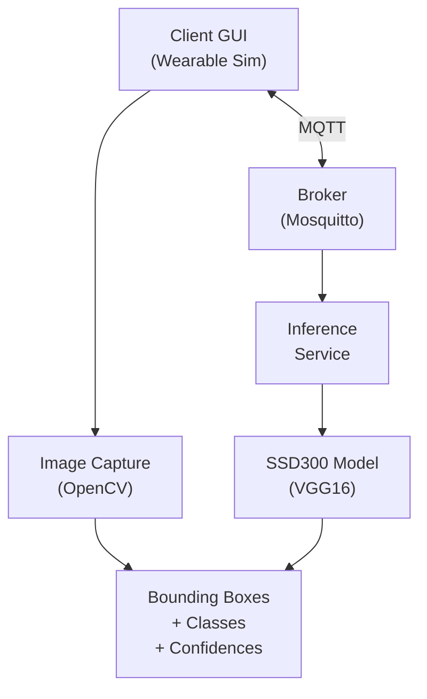
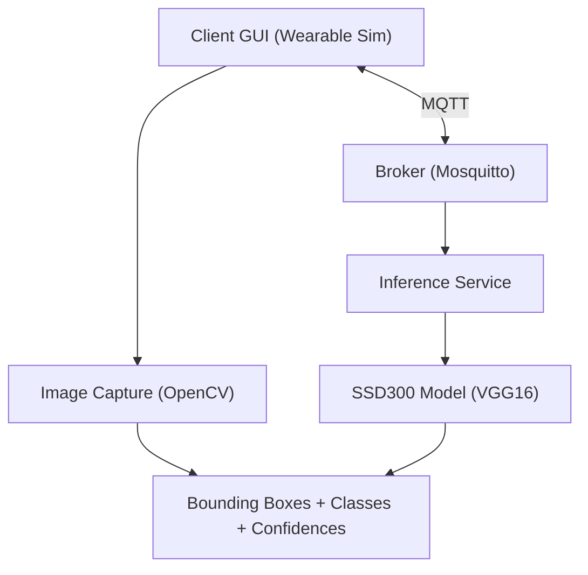
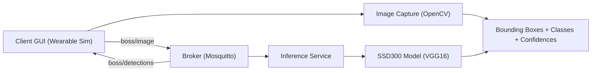
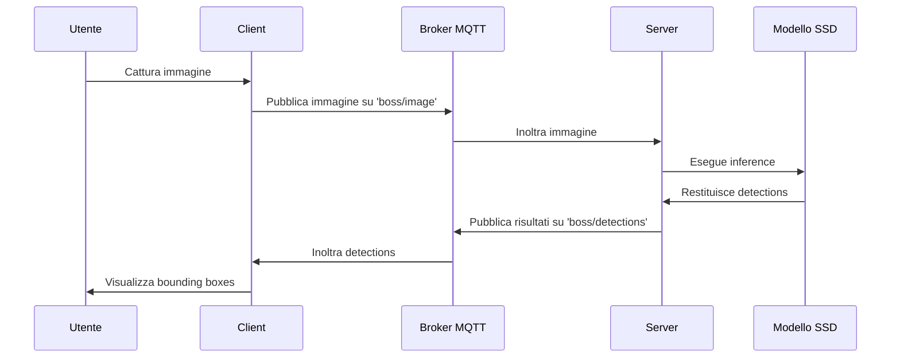
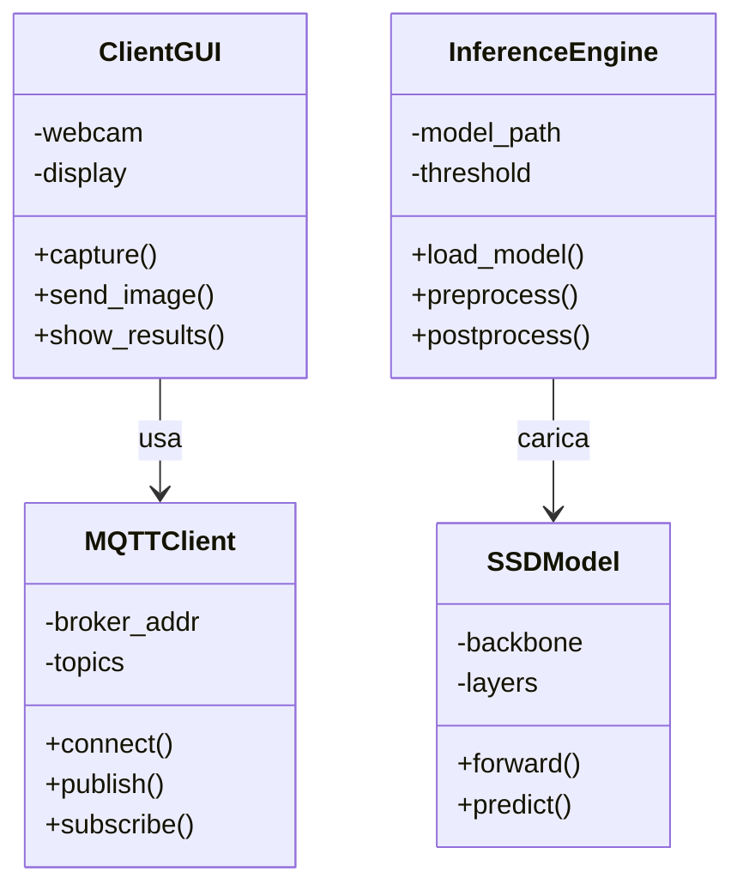
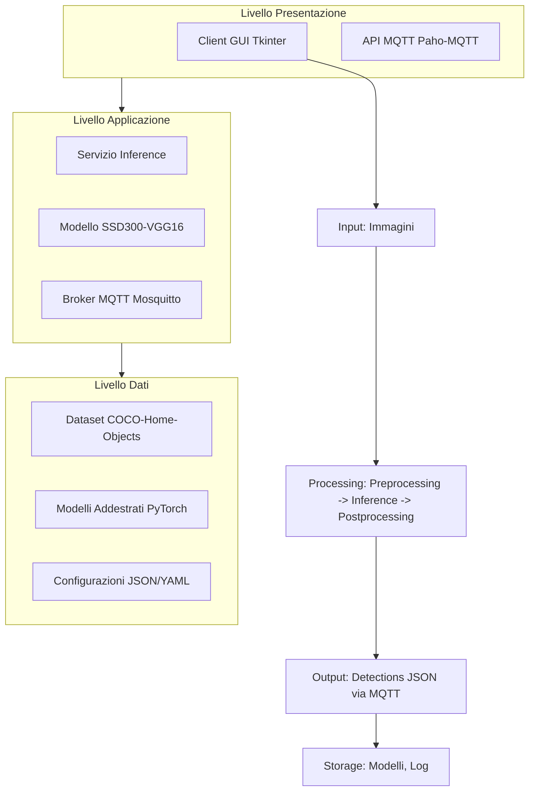
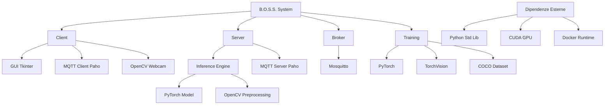
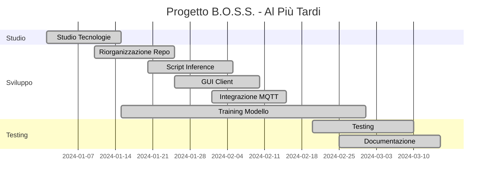
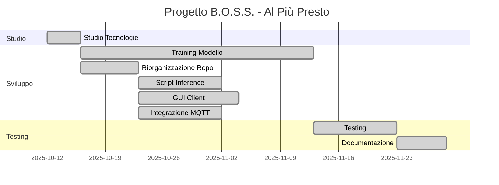
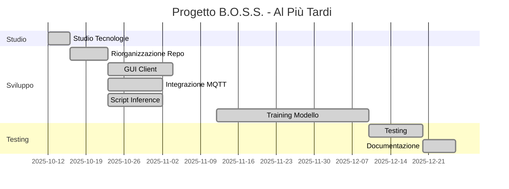

# 🚀 B.O.S.S. (Blind Oriented Suggested System) - SSD300 VGG16 Branch

  

[](https://www.python.org/)

[](https://pytorch.org/)

[](https://www.docker.com/)

[](https://mosquitto.org/)

[](LICENSE)

  

**Un sistema avanzato di Computer Vision per il riconoscimento di oggetti domestici, progettato per supportare la navigazione autonoma e la sicurezza attraverso l'individuazione di ostacoli in tempo reale.** 🎯

  

Questo progetto implementa una rete neurale **SSD300** basata su **VGG16** per il rilevamento di oggetti, integrata in un'architettura client-server distribuita con comunicazione MQTT. Ideale per dispositivi wearable come occhiali smart per non vedenti.

  

---

  

## 📋 Tabella dei Contenuti

- [🎯 Obiettivo](#-obiettivo)

- [🛠️ Tecnologie Utilizzate](#️-tecnologie-utilizzate)

- [🏗️ Architettura del Sistema](#️-architettura-del-sistema)

- [⚡ Quickstart](#-quickstart)

- [📦 Installazione](#-installazione)

- [🚀 Utilizzo](#-utilizzo)

- [🧠 Training del Modello](#-training-del-modello)

- [🔍 Inference e Rilevamento](#-inference-e-rilevamento)

- [📡 API MQTT](#-api-mqtt)

- [🐳 Docker Deployment](#-docker-deployment)

- [📐 Diagrammi UML](#-diagrammi-uml)

- [📋 FURPS+](#-furps)

- [🔗 Schema Logico del Sistema](#-schema-logico-del-sistema)

- [✅ CheckList Tecnologie Coinvolte](#-checklist-tecnologie-coinvolte)

- [📊 Grafo delle Dipendenze](#-grafo-delle-dipendenze)

- [📅 Diagrammi di Gantt](#-diagrammi-di-gantt)

- [🔒 Compliance GDPR](#-compliance-gdpr)

- [🤝 Contributi](#-contributi)

- [📄 Licenza](#-licenza)

  

---

  

## 🎯 Obiettivo

  

Il progetto **B.O.S.S.** mira a sviluppare un sistema di assistenza visiva basato su intelligenza artificiale per supportare persone con disabilità visive. Utilizzando tecniche avanzate di Computer Vision, il sistema rileva e classifica oggetti domestici in tempo reale, fornendo feedback audio/visuale per una navigazione sicura.

  

**Caratteristiche chiave:**

- 🎥 Rilevamento oggetti in tempo reale da immagini/video

- 📱 Interfaccia utente minimale per dispositivi wearable

- 🔄 Comunicazione asincrona via MQTT

- 🐳 Containerizzazione completa con Docker

- ⚡ Inferenza ottimizzata su GPU/CPU

  

---

  

## 🛠️ Tecnologie Utilizzate

  

### Core AI/ML

-  **PyTorch** 🧠: Framework per il deep learning, utilizzato per l'implementazione e l'addestramento del modello SSD300

-  **TorchVision** 👁️: Libreria per computer vision, fornisce il backbone VGG16 pre-addestrato

-  **OpenCV** 📸: Per l'elaborazione di immagini e video, cattura da webcam e preprocessing

  

### Architettura Distribuita

-  **MQTT (Mosquitto)** 📡: Protocollo di messaggistica leggera per comunicazione client-server

-  **Docker & Docker Compose** 🐳: Containerizzazione per deployment scalabile e portabile

  

### Sviluppo e Deployment

-  **Python 3.8+** 🐍: Linguaggio principale per tutti i componenti

-  **NumPy & Pillow** 🔢: Manipolazione di array e immagini

-  **Tkinter** 🖼️: GUI semplice per il client wearable

-  **Paho-MQTT** 📨: Libreria Python per MQTT

  

### Dataset

-  **COCO-Home-Objects** 🏠: Dataset personalizzato basato su COCO per oggetti domestici comuni

  

---

  

## 🏗️ Architettura del Sistema

  

```     
      +-----------------+   MQTT   +-----------------+
      | Client GUI      |<-------->|     Broker      |
      | (Wearable Sim)  |          |   (Mosquitto)   |
      +-----------------+          +-----------------+
              |                          |
              v                          v
      +------------------+      +-----------------+
      | Image Capture    |      | Inference       |
      | (OpenCV)         |      | Service         |
      +------------------+      +-----------------+
              |                          |
              v                          v
      +------------------+       +-----------------+
      | Bounding Boxes   |<----- | SSD300 Model    |
      | + Classes        |       | (VGG16)         |
      | + Confidences    |       +-----------------+
      +------------------+
```

  



 

  
  ---

### Componenti Dettagliati

  

#### 1. **Modello SSD300-VGG16** 🧠

-  **Single Shot MultiBox Detector (SSD)**: Architettura one-stage per object detection

-  **VGG16 Backbone**: Rete convoluzionale pre-addestrata su ImageNet per feature extraction

-  **300x300 Input**: Risoluzione ottimale per velocità/inferenza bilanciata

-  **Output**: Bounding boxes, classi e punteggi di confidenza per ogni detection

  

#### 2. **Servizio Inference** 🔍

- Riceve immagini via MQTT

- Preprocessing: resize a 300x300, normalizzazione

- Inferenza: passaggio attraverso il modello SSD

- Post-processing: NMS (Non-Maximum Suppression), thresholding

- Output: JSON con detections (bbox, class, confidence)

  

#### 3. **Client Wearable** 📱

- Simulazione di occhiali smart

- Cattura immagini da webcam

- Invio al server via MQTT

- Visualizzazione risultati: overlay di bounding boxes

  

#### 4. **Broker MQTT** 📡

-  **Mosquitto**: Broker leggero e performante

- Topics: `boss/image`, `boss/detections`

- QoS 1: Garantisce consegna almeno una volta

  

---

  

## ⚡ Quickstart

  

Vuoi provare B.O.S.S. in 5 minuti? 🚀

  

```bash

# 1. Clona la repository

git  clone  https://github.com/tuo-username/B.O.S.S.-SSD300-VGG16.git

cd  B.O.S.S.-SSD300-VGG16

  

# 2. Avvia tutto con Docker

docker-compose  up  --build

  

# 3. Apri un altro terminal e avvia il client

docker  exec  -it  boss_client  python  client/client.py

  

# 4. Guarda la magia! 🎉

```

  

Il sistema sarà attivo su `localhost` con interfaccia web minimale.

  

---

  

## 📦 Installazione

  

### Prerequisiti

- Python 3.8+

- Docker & Docker Compose

- Webcam (per il client)

- GPU NVIDIA (opzionale, per training accelerato)

  

### Installazione Locale

  

```bash

# Crea ambiente virtuale

python  -m  venv  .venv

source  .venv/bin/activate  # Linux/Mac

# .venv\Scripts\activate # Windows

  

# Installa dipendenze

pip  install  -r  requirements.txt

  

# Per inference specifico

pip  install  -r  inference/requirements_inference.txt

```

  

### Configurazione Dataset

```bash

# Scarica il dataset COCO-Home-Objects

# (istruzioni in training/README_dataset.txt)

```

  

---

  

## 🚀 Utilizzo

  

### Avvio del Sistema

  

```bash

# Avvia il broker MQTT

docker-compose  -f  broker/test_mqtt/docker-compose.yaml  up  -d

  

# Avvia il server inference

python  server/server.py

  

# Avvia il client GUI

python  client/client.py

```

  

### Test Inference Singola Immagine

  

```python

from inference.inference_image import detect_objects

  

# Carica immagine

image_path = "path/to/your/image.jpg"

detections = detect_objects(image_path)

  

# Output: lista di dict con 'bbox', 'class', 'confidence'

for det in detections:

print(f"Classe: {det['class']}, Confidenza: {det['confidence']:.2f}")

```

  

### Test Video Real-time

  

```bash

python  inference/inference_video.py  --source  webcam

```

  

---

  

## 🧠 Training del Modello

  

### Preparazione Dataset

```bash

cd  training

python  dataset_builder.py  # Costruisce dataset da COCO

```

  

### Addestramento

```bash

python  main.py  --config  config.json

```

  

**Parametri chiave:**

-  **Batch Size**: 16-32 (dipende dalla GPU)

-  **Learning Rate**: 1e-3 iniziale, decay esponenziale

-  **Epochs**: 100+ per convergenza

-  **Optimizer**: SGD con momentum 0.9

-  **Loss**: Multibox loss (localization + classification)

  

### Monitoraggio Training

- Log salvati in `training_log_ssd_coco.txt`

- TensorBoard per metriche (se configurato)

  

---

  

## 🔍 Inference e Rilevamento

  

### Processo Tecnico

  

1.  **Preprocessing**:

- Resize immagine a 300x300

- Normalizzazione con mean=[0.485, 0.456, 0.406], std=[0.229, 0.224, 0.225]

- Conversione a tensor PyTorch

  

2.  **Forward Pass**:

- Feature extraction con VGG16 fino a conv4_3

- Extra feature layers per multiscale detection

- Predictions: class scores + bbox offsets

  

3.  **Post-processing**:

- Softmax su classi

- Decode bbox da offsets relativi

- Non-Maximum Suppression (IoU threshold 0.45)

- Confidence threshold 0.5

  

### Output Format

```json

{

"detections": [

{

"class": "chair",

"confidence": 0.87,

"bbox": [x1, y1, x2, y2]

}

]

}

```

  

---

  

## 📡 API MQTT

  

### Topics

  
| Topic           | Direzione       | Payload              | Descrizione            |
| --------------- | --------------- | -------------------- | ---------------------- |
| boss/image      | Client → Server | Base64 encoded image | Immagine da analizzare |
| boss/detections | Server → Client | JSON detections      | Risultati rilevamento  |

### Esempio Client MQTT

  

```python

import paho.mqtt.client as mqtt

  

client = mqtt.Client()

client.connect("localhost", 1883)

  

# Pubblica immagine

client.publish("boss/image", encoded_image)

  

# Sottoscrivi risultati

client.subscribe("boss/detections")

```

  

---

  

## 🐳 Docker Deployment

  

### Struttura Container

-  **boss_server**: Servizio inference con GPU support

-  **boss_client**: GUI client con Tkinter

-  **boss_broker**: Mosquitto MQTT broker

  

### Build e Run

```bash

# Build tutti i servizi

docker-compose  build

  

# Avvia in background

docker-compose  up  -d

  

# Logs

docker-compose  logs  -f  boss_server

```

  

### Configurazione GPU

Per utilizzare GPU NVIDIA:

```yaml
# In docker-compose.yaml

services:

server:

deploy:

resources:

reservations:

devices:

- driver: nvidia

count: 1

capabilities: [gpu]
```
---

  

## 📐 Diagrammi UML

  

### Diagramma di Sequenza



  

### Diagramma delle Classi



  

### Diagramma dei Casi d'Uso


  

---

  

## 📋 FURPS+

  

### Funzionali (Functional)

-  **Rilevamento Oggetti**: Il sistema deve identificare oggetti domestici con accuratezza >80%

-  **Classificazione**: Assegnare classi corrette agli oggetti rilevati

-  **Bounding Boxes**: Fornire coordinate precise delle bounding boxes

-  **Confidenza**: Calcolare punteggi di confidenza per ogni detection

-  **Real-time Processing**: Elaborare immagini entro 500ms

  

### Utilità (Usability)

-  **Interfaccia Semplice**: GUI minimale accessibile per utenti con disabilità visive

-  **Feedback Visivo**: Overlay di bounding boxes chiare e leggibili

-  **Audio Support**: Possibilità di output vocale (futuro)

-  **Configurabilità**: Soglie di confidenza regolabili

  

### Affidabilità (Reliability)

-  **Disponibilità**: Uptime >99% in condizioni normali

-  **Robustezza**: Gestione errori di rete e perdita connessione MQTT

-  **Ripristino**: Recovery automatico da crash del modello

-  **Accuratezza**: Mantenimento performance su dataset variati

  

### Performance (Performance)

-  **Velocità Inference**: <500ms per immagine 300x300

-  **Throughput**: Supporto fino a 10 FPS su GPU

-  **Scalabilità**: Possibilità di scaling orizzontale con più server

-  **Efficienza Memoria**: <2GB RAM per inferenza singola

  

### Supportabilità (Supportability)

-  **Manutenibilità**: Codice modulare e ben documentato

-  **Testabilità**: Suite di test completa per tutti i componenti

-  **Configurabilità**: Parametri regolabili via file di configurazione

-  **Monitoraggio**: Logging dettagliato per debugging

  

### + (Sicurezza, Privacy, etc.)

-  **Sicurezza**: Autenticazione MQTT opzionale

-  **Privacy**: Nessun storage permanente di immagini utente

-  **Compliance**: Adesione a GDPR per dati personali

-  **Portabilità**: Deployment su diverse piattaforme via Docker

  

---

  

## 🔗 Schema Logico del Sistema

  



  

---

  

## ✅ CheckList Tecnologie Coinvolte

  

- [x] **Python 3.8+**: Linguaggio principale

- [x] **PyTorch 1.9+**: Framework deep learning

- [x] **TorchVision**: Backbone VGG16 e utilities

- [x] **OpenCV**: Elaborazione immagini/video

- [x] **MQTT (Mosquitto)**: Comunicazione distribuita

- [x] **Paho-MQTT**: Libreria Python MQTT

- [x] **Docker & Compose**: Containerizzazione

- [x] **Tkinter**: GUI client

- [x] **NumPy & Pillow**: Manipolazione dati

- [x] **COCO Dataset**: Dataset di training

- [ ] **TensorBoard**: Monitoraggio training (opzionale)

- [ ] **GPU NVIDIA**: Accelerazione CUDA (opzionale)

  

---

  

## 📊 Grafo delle Dipendenze

  



  

---

  

## 📅 Diagrammi di Gantt

  

### Diagramma di Gantt (Al Più Presto)


  

### Diagramma di Gantt (Al Più Tardi)



  

**Note:** I diagrammi mostrano un progetto di circa 10 settimane. Il percorso critico passa attraverso Studio Tecnologie → Training Modello → Testing.


**MODIFICATI**  






---

  

## 🔒 Compliance GDPR

  

### Principi GDPR Applicati

-  **Legittimità**: Sistema utilizzato per assistenza medica/disabilità (art. 9 GDPR)

-  **Minimizzazione Dati**: Solo immagini temporanee, nessun storage permanente

-  **Limitazione Finalità**: Uso esclusivo per object detection in tempo reale

-  **Accuratezza**: Modello addestrato per ridurre falsi positivi

-  **Sicurezza**: Comunicazione crittografata MQTT (opzionale TLS)

-  **Responsabilità**: Logging per audit trail

  

### Misure Tecniche

-  **Anonimizzazione**: Nessun dato personale associato alle immagini

-  **Crittografia**: Possibilità di TLS per MQTT

-  **Access Control**: Solo utenti autorizzati possono accedere al sistema

-  **Data Retention**: Immagini elaborate immediatamente, non conservate

-  **Diritto all'Oblio**: Nessun dato persistente da cancellare

  

### Valutazione Impatto (DPIA)

-  **Rischio Basso**: Sistema non elabora dati personali identificabili

-  **Mitigazioni**: Implementare autenticazione se necessario

-  **Monitoraggio**: Audit log per compliance

  

---

  

## 🤝 Contributi

  

Contributi benvenuti! 🎉

  

1. Fork il progetto

2. Crea un branch per la tua feature (`git checkout -b feature/AmazingFeature`)

3. Commit le tue modifiche (`git commit -m 'Add some AmazingFeature'`)

4. Push al branch (`git push origin feature/AmazingFeature`)

5. Apri una Pull Request

  

### Linee Guida

- Segui PEP 8 per Python

- Aggiungi docstrings alle funzioni

- Testa su Python 3.8+ e 3.9+

- Aggiorna il README se necessario

  

---

  

## 📄 Licenza

  

Questo progetto è distribuito sotto licenza MIT. Vedi il file `LICENSE` per dettagli.

  

---

  <!-- 

## 🙏 Ringraziamenti

  

-  **Prof. Bellusci** per la supervisione

-  **Gruppo Albore-Lorè-Martemucci** per il lavoro iniziale

-  **PyTorch Team** per il framework eccezionale

-  **Comunità Open Source** per le librerie utilizzate

  
 -->
---

  

*Creato con ❤️ per rendere il mondo più accessibile attraverso la tecnologia AI.*