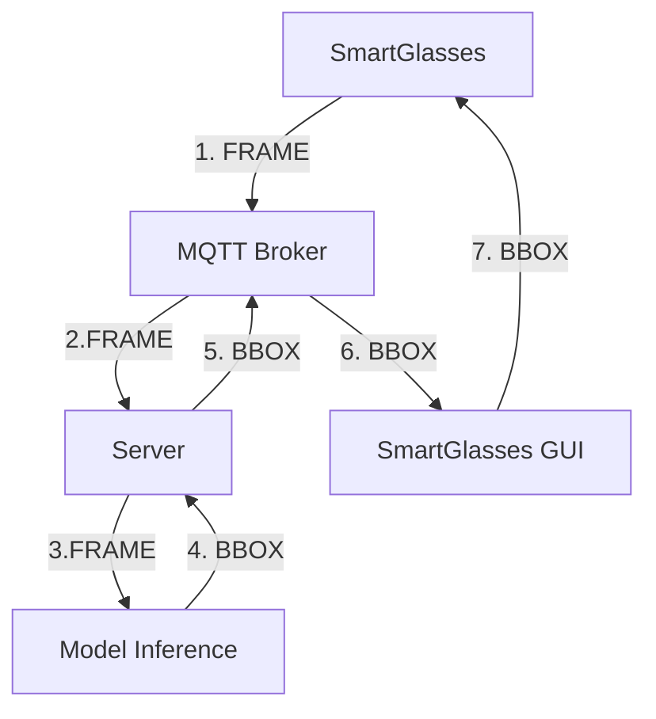
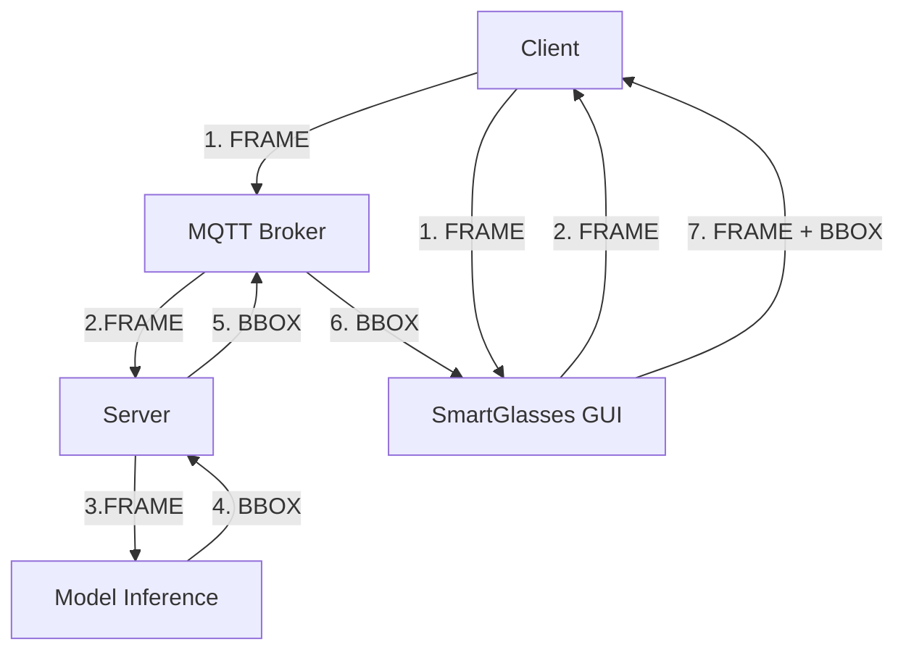
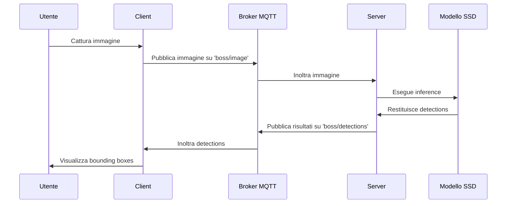
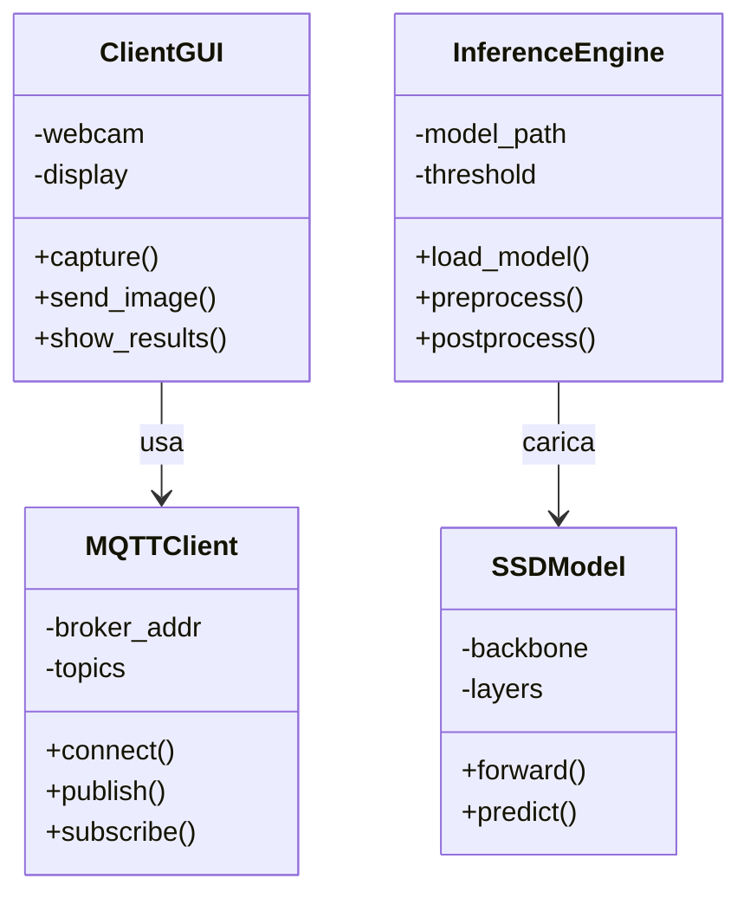
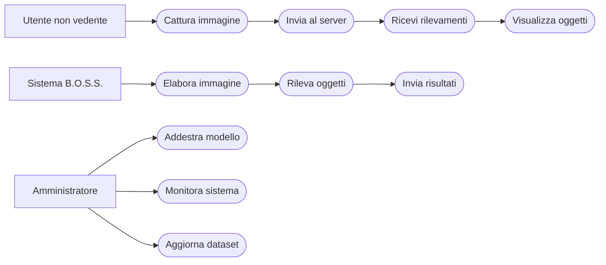
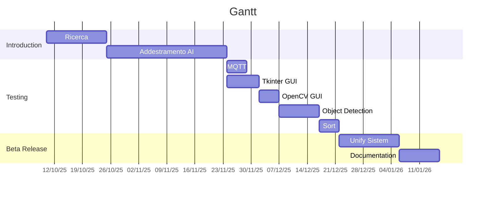

# 🚀 B.O.S.S. (Blind Oriented Suggested System) - SSD300 VGG16 Branch

  

[](https://www.python.org/)
[](https://pytorch.org/) 
[](https://opencv.org/)

[](https://www.docker.com/) 
[](https://mosquitto.org/)
[](https://universe.roboflow.com/objectdetection-uzld5/coco-home-objects)


Questo progetto implementa una rete neurale **SSD300** basata su **VGG16** per il rilevamento di oggetti, integrata in un'architettura publisher-subscriber distribuita con comunicazione MQTT, coadiuvata da una GUI minimale su SmartGlasses Emulati.
  

---

  

## 📋 Tabella dei Contenuti

- [🎯 Obiettivo](#-obiettivo)

- [🛠️ Tecnologie Utilizzate](#-tecnologie-utilizzate)

- [🏗️ Architettura del Sistema Ideale](#-architettura-del-sistema-ideale)

- [🏗️ Architettura del Sistema Emulando gli SmartGlasses](#-architettura-del-sistema-emulando-gli-smartglasses)

- [⚡ Quickstart](#-quickstart)

- [🧠 Training del Modello](#-training-del-modello)

- [📡 API MQTT](#-api-mqtt)

- [🐳 Docker Deployment](#-docker-deployment)

- [📐 Diagrammi UML](#-diagrammi-uml)

- [✅ CheckList Tecnologie Coinvolte](#-checklist-tecnologie-coinvolte)
  

---

  

## 🎯 Obiettivo

  

Il progetto **B.O.S.S.** mira a sviluppare un sistema di assistenza visiva basato su intelligenza artificiale per supportare persone con disabilità visive mediante degli occhiali da vista intelligenti. Utilizzando tecniche avanzate di Computer Vision, il sistema rileva e classifica oggetti domestici in tempo reale, fornendo feedback video per una navigazione sicura.

  

**Caratteristiche chiave:**

- 🎥 Rilevamento oggetti in tempo reale

- 📱 Interfaccia utente minimale per dispositivi wearable (AKA Smart Glasses)

- 🔄 Comunicazione asincrona via MQTT

- 🐳 Containerizzazione completa con Docker

- ⚡ Inferenza ottimizzata su GPU e CPU


---
  

## 🛠️ Tecnologie Utilizzate

### Artificial Intelligence and Learning Core

-  🧠 **PyTorch**: Framework per il deep learning, utilizzato per l'implementazione e l'addestramento del modello SSD300

-  👁 **TorchVision**: Libreria per computer vision, fornisce il backbone VGG16 pre-addestrato

-  📸 **OpenCV**: Per l'elaborazione di immagini e video, cattura da webcam e preprocessing

  

### Architettura Distribuita

-  📡 **MQTT (Mosquitto)**: Protocollo di messaggistica leggera per comunicazione basato su modello publisher/subscriber

-  🐳 **Docker & Docker Compose**: Containerizzazione per deployment scalabile e portabile

  

### Sviluppo e Deployment

-  🐍 **Python 3.13**: Linguaggio principale per tutti i componenti

-  🔢 **NumPy & Pillow**: Manipolazione di array e immagini

-  📨 **Paho-MQTT**: Libreria Python per MQTT

  

### Dataset

-  🏠 **COCO-Home-Objects**: Dataset espanso basato su COCO per oggetti domestici comuni

---


## 🏗️ Architettura del Sistema Ideale




---


## 🏗️ Architettura del Sistema Emulando gli SmartGlasses




---

### Componenti Dettagliati


#### 1. 🧠 **Modello SSD300-VGG16** 

-  **Single Shot MultiBox Detector (SSD)**: Architettura one-stage per object detection, fornendo in un solo passaggio sia le coordinate spaziali sia la classificazione

-  **VGG16 Backbone**: Rete convoluzionale pre-addestrata su ImageNet per feature extraction

-  **300x300 Input**: Risoluzione ottimale per velocità/inferenza bilanciata

-  **Output**: Bounding boxes, classi e punteggi di confidenza per ogni detection

  

#### 2. 🔍 **Servizio Inference** 

- Riceve immagini convertite in bytes via **MQTT**

- **Preprocessing**: resize a 300x300, normalizzazione

- **Inferenza**: passaggio attraverso il modello SSD

- **Post-processing**: NMS (Non-Maximum Suppression), thresholding

- **Output**: JSON con detections (bbox, class, confidence)

  

#### 3. 👓 **Client Wearable**

- Simulazione di **occhiali intelligenti**

- Cattura **frame** da video

- Invio al server via **MQTT**

- **Visualizzazione risultati**: overlay di bounding boxes


#### 4. 📡 **Broker MQTT** 

-  **Mosquitto**: Broker leggero e performante

- **Topics**: 
  - `smartglasses/frame` permette l'invio del frame, convertito in bytes, al server di inferenza
  - `smartglasses/pred` permette l'invio delle predizioni, formulate in una struttura JSON, al client wereable

- **QoS = 1**: Garantisce consegna almeno una volta nella comunicazione

  
---

  

## ⚡ Quickstart


Vuoi provare B.O.S.S. in 5 minuti? 🚀


```bash

# 1. Clona la repository

git  clone  https://github.com/riccardosemeraro/B.O.S.S.-SSD300-VGG16.git

cd  B.O.S.S.-SSD300-VGG16

  

# 2. Build e Avvio tutto con Docker

docker-compose up --build

# N.B. Per esecuzione su MacOS, richiede XQuartz

# 3. Guarda la magia! 🎉

```

Il sistema sarà attivo utilizzando 3 container (`server`, `client`, `mqtt_broker`).

---
  

## 📦 Installazione Locale
  

### Prerequisiti

- Python 3.13

- Docker & Docker Compose

- GPU NVIDIA (opzionale)

- CONDA


```bash

# Crea ambiente virtuale
conda create -p ./.venv python=3.13 pip

# Attiva ambiente virtuale
conda activate ./.venv

# Installa dipendenze
pip install -r inference/requirements_inference.txt

# Avvio container mqtt
# in questo caso cambia BROKER_CONTAINER="localhost" invece di "mqtt_broker" in broker/configuration.py
docker run -d --name mosquitto -p 1883:1883 eclipse-mosquitto

# Avvio server
python3 server/server.py

# Avvio client
python3 client/client.py
```

  

### Configurazione Dataset

```bash

# Scarica il dataset COCO-Home-Objects al link 
# https://universe.roboflow.com/objectdetection-uzld5/coco-home-objects
# istruzioni in training/README_dataset.txt

```

---
  

## 🧠 Training del Modello
Il training del modello è stato eseguito mediante il
Jupyter Notebook in training/jupyter Google Colab

---

## 📡 API MQTT

  

### Topics

  
| Topic              | Direzione       | Payload              | Descrizione            |
|--------------------| --------------- | -------------------- | ---------------------- |
| smartglasses/frame | Client → Server | Base64 encoded image | Immagine da analizzare |
| smartglasses/pred  | Server → Client | JSON detections      | Risultati rilevamento  |


---
  

## 🐳 Docker Deployment

  

### Struttura Container

-  **server**: Servizio inference con GPU support

-  **client**: GUI client con Tkinter

-  **mqtt_broker**: Mosquitto MQTT broker
  

### Build e Run

```bash

# Build e Avvio del docker-compose

docker-compose up -d --build

```

  

### Configurazione GPU

Per l'addestramento del modello si è ricorso a GOOGLE COLAB, il quale fornisce la GPU NVIDIA T4 per un periodo di 2/3 ore circa al giorno. Tramite addestramento basato su checkpoint si sono eseguite 100 epoche, di cui 20 sulla "testa" e 80 sul "corpo".

Per l'inferenze eseguita dal server, invece, si ricorre alla CPU APPLE SILICON M\*, ottimizzata per inferenze su singolo thread (non parallele). 

---

## 📐 Diagrammi UML


### Diagramma di Sequenza



  

### Diagramma delle Classi



  

### Diagramma dei Casi d'Uso




---

  

## ✅ CheckList Tecnologie Coinvolte

  

- [x] **Python 3.13**: Linguaggio principale

- [x] **PyTorch 2.8**: Framework deep learning

- [x] **TorchVision**: Backbone VGG16 e utilities

- [x] **OpenCV**: Elaborazione immagini/video, GUI minimale

- [x] **MQTT (Mosquitto)**: Comunicazione distribuita, broker

- [x] **Paho-MQTT**: Libreria Python MQTT per Client e Server

- [x] **Docker & Compose**: Containerizzazione

- [x] **NumPy & Pillow**: Manipolazione dati

- [x] **COCO Dataset**: Dataset di training

- [x] **GPU NVIDIA**: Accelerazione CUDA (usata su Google Colab)

---

